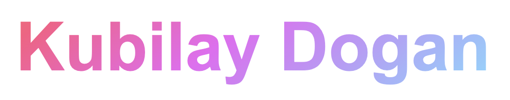

<!-- <h1 align="center" style="font-family: Arial, sans-serif; text-align: center; background: linear-gradient(141.27deg, #ff904e -4.24%, #ff5982 21.25%, #ec68f4 44.33%, #79e2ff 83.46%); -webkit-background-clip: text; color: transparent;">
  <a href="https://github.com/kubilaydogan" style="text-decoration: none; color: inherit;">
    Kubilay Dogan
  </a>
</h1> -->

    

    

<!-- Social icons section -->

  

 

    
    
    

    

 

<h3 align="center">👨‍💻 Languages</h3>

  
  
  
  
  

<h3 align="center">🧰 Frameworks & Testing</h3>

  
  
  
  
  
  
  
  
    
  
  

<h3 align="center">🔧 Tools</h3>

  
  
  

<h3 align="center">🗄️ Databases</h3>

  
  
  
  

